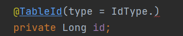
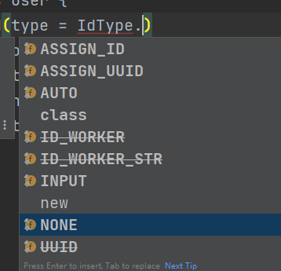
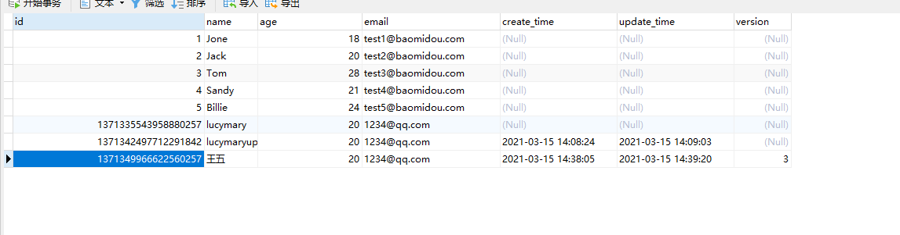

# 学习笔记

## 1、springboot2.1和2.0对于mysql配置区别

1. springboot2.0（内置jdbc5驱动）

   ```properties
   #mysql数据库连接
   spring.datasource.driver-class-name=com.mysql.jdbc.Driver
   spring.datasource.url=jdbc:mysql://localhost:3306/mybatis_plus?characterEncoding=utf-8&useSSL=false
   spring.datasource.username=root
   spring.datasource.password=root
   ```

2. springboot2.1及以上（内置jdbc8驱动）

   ```properties
   spring.datasource.driver-class-name=com.mysql.cj.jdbc.Driver
   spring.datasource.url=jdbc:mysql://localhost:3306/mybatis_plus?serverTimezone=GMT%2B8
   spring.datasource.username=root
   spring.datasource.password=root
   ```

**注意：driver和url的变化**

1. 这里的 url 使用了 ?serverTimezone=GMT%2B8 后缀，因为8.0版本的jdbc驱动需要添加这个后缀，否则运行测试用例报告如下错误：java.sql.SQLException: The server time zone value 'Öйú±ê׼ʱ¼ä' is unrecognized or represents more 
2. 这里的 driver-class-name 使用了  com.mysql.cj.jdbc.Driver ，在 jdbc 8 中 建议使用这个驱动，否则运行测试用例的时候会有 WARN 信息

## 2、mybatis日志输出sql语句

```properties
#mybatis日志
mybatis-plus.configuration.log-impl=org.apache.ibatis.logging.stdout.StdOutImpl
```

## 3、mp主键策略






- **ASSIGN_ID**

  随机19位的唯一值

- ASSIGN_UUID

  随机UUID

- **AUTO**

  自动增长

- INPUT

  需要自己设置.setId()

- NONE

  没有策略，也需要自己设置

> **ASSIGN_ID**
>
> 雪花算法生成
>
> 整体上按照时间自增排序，并且整个分布式系统内不会产生ID碰撞，并且效率较高。

mp中全局默认**ASSIGN_ID**

可以通过配置文件修改

```properties
#全局设置主键生成策略
mybatis-plus.global-config.db-config.id-type=auto
```

## 4、mp自动填充

1. 实体类上要进行自动填充属性添加注解

   ```java
   @TableField(fill = FieldFill.INSERT)
   private Date createTime;
   @TableField(fill = FieldFill.INSERT_UPDATE)
   private Date updateTime;
   ```

   

2. 创建类，托管自动填充逻辑

   继承MetaObjectHandler，实现insertFill()和updateFill()

   ```java
   /**
    * MyMetaObjectHandler <br>
    *
    * @author CQ <br>
    * @version 1.0 <br>
    * @date 2021-03-15 14:03 <br>
    */
   @Component
   public class MyMetaObjectHandler implements MetaObjectHandler {
       /**
        * 插入元对象字段填充（用于插入时对公共字段的填充）
        *
        * @param metaObject 元对象
        */
       @Override
       public void insertFill(MetaObject metaObject) {
           this.setFieldValByName("createTime",new Date(),metaObject);
           this.setFieldValByName("updateTime",new Date(),metaObject);
       }
   
       /**
        * 更新元对象字段填充（用于更新时对公共字段的填充）
        *
        * @param metaObject 元对象
        */
       @Override
       public void updateFill(MetaObject metaObject) {
           this.setFieldValByName("updateTime",new Date(),metaObject);
   
       }
   }
   ```

## 5、mp乐观锁

1. 什么是乐观锁？

   当要更新一条记录的时候，希望这条记录没有被别人更新

2. 乐观锁实现方式：

   - 取出记录时，获取当前version
   - 更新时，带上这个version
   - 执行更新时， set version = newVersion where version = oldVersion
   - 如果version不对，就更新失败

3. mp使用乐观锁

   1. 表中添加字段，实体类添加字段和注解

      

      

      ```java
      @Version
      private Integer version;
      ```

   2. 配置乐观锁插件，注意注入@Bean

      - mp3.4之前

        ```java
        @Configuration
        @MapperScan("cn.cq.demomptest.mapper")
        public class MybatiPlusConfig {
            @Bean
            public OptimisticLockerInterceptor optimisticLockerInterceptor(){
                return new OptimisticLockerInterceptor();
            }
        }
        ```

      - mp3.4及以后

        ```java
        @Configuration
        @MapperScan("cn.cq.demomptest.mapper")
        public class MybatiPlusConfig {
            @Bean
            public MybatisPlusInterceptor mybatisPlusInterceptor(){
                MybatisPlusInterceptor interceptor = new MybatisPlusInterceptor();
                interceptor.addInnerInterceptor(new OptimisticLockerInnerInterceptor());
                return interceptor;
            }
        }
        ```

   3. 观察version会增加

      

## 6、Arrays.asList

返回一个数组

```java
Arrays.asList(1, 2, 3)
```

## 7、mp分页查询

1. 配置分页插件

   ```java
   @Bean
   public MybatisPlusInterceptor mybatisPlusInterceptor(){
       MybatisPlusInterceptor interceptor = new MybatisPlusInterceptor();
       interceptor.addInnerInterceptor(new OptimisticLockerInnerInterceptor());
       /**
        * 新的分页插件,一缓和二缓遵循mybatis的规则,需要设置 MybatisConfiguration#useDeprecatedExecutor = false 避免缓存出现问题(该属性会在旧插件移除后一同移除)
        */
       interceptor.addInnerInterceptor(new PaginationInnerInterceptor(DbType.MYSQL));
       return interceptor;
   }
   @Bean
   public ConfigurationCustomizer configurationCustomizer() {
       return configuration -> configuration.setUseDeprecatedExecutor(false);
   }
   ```

2. 编写分页代码

   1. page对象
      - 当前页
      - 每页记录数
   2. 调用mp的方法实现分页

   ```java
   //分页查询
   @Test
   public void testSelectPage(){
       Page<User> page = new Page<>(1,3);
       //返回对象得到分页所有数据
       Page<User> userPage = userMapper.selectPage(page, null);
       //总页数
       long pages = userPage.getPages();
       //当前页
       long current = userPage.getCurrent();
       //查询数据集合
       List<User> records = userPage.getRecords();
       //总记录数
       long total = userPage.getTotal();
       //是否存在上下一页
       boolean hasNext = userPage.hasNext();
       boolean hasPrevious = userPage.hasPrevious();
       System.out.println(pages);
       System.out.println(current);
       System.out.println(records);
       System.out.println(total);
       System.out.println(hasNext);
       System.out.println(hasPrevious);
   }
   ```

## 8、逻辑删除

1. 表添加字段，实体类添加属性

   

   ```java
   @TableField(fill = FieldFill.INSERT)
   private Integer deleted;
   ```

2. 设置初始值

   ```java
   this.setFieldValByName("deleted",0,metaObject);
   ```

3. 查询时，默认查询0，未逻辑删除的数据

