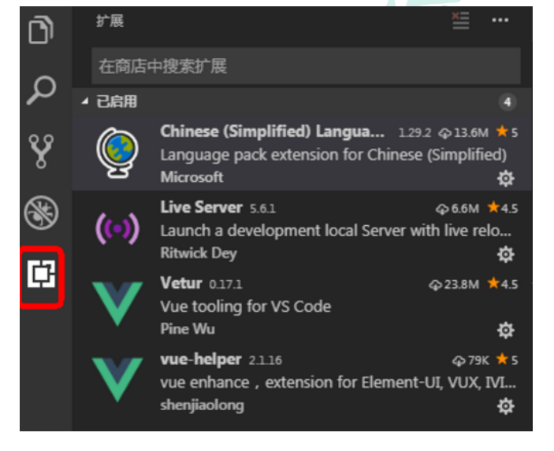
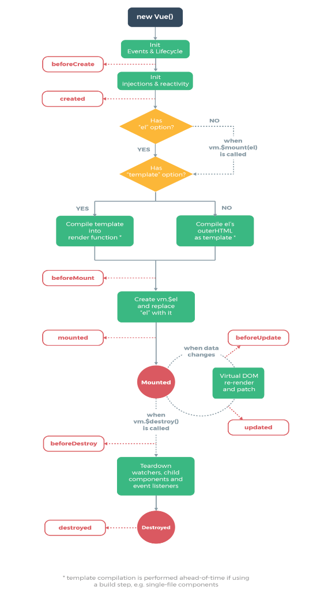
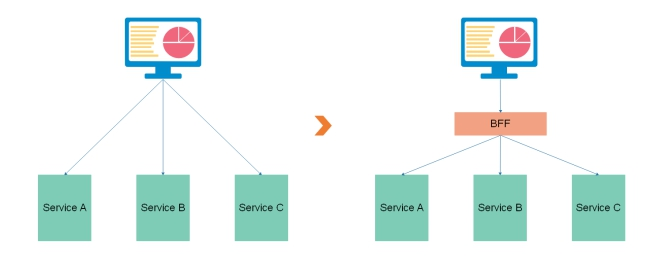
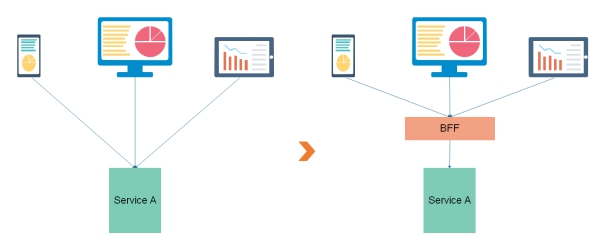

# 前端

## 1、开发工具

### vscode

#### 1.下载地址

https://code.visualstudio.com/

#### 2.插件安装



## 2、ES6

### 1.1什么是ES6

ECMAScript 6.0（简称 ES6）是 JavaScript 语言的下一代标准， 2015 年 6 月正式发布。它的目标，是使得 JavaScript 语言可以用来编写复杂的大型应用程序，成为企业级开发语言。

### 1.2es6和JavaScript什么关系

ECMAScript 和 JavaScript 的关系是，前者是后者的规格，后者是前者的一种实现（另外的 ECMAScript 方言还有 Jscript 和 ActionScript）

### 2.es6语法

#### 2.1es6定义变量

var声明的变量没有局部作用域

let声明的变量     有局部作用域

var可以声明多次

let只能声明一次

```html
	//定义变量
    {
      var a = 1;
      let b = 2;
    }
    //console.log(a);
    //console.log(b);//b is not defined


    var m = 1;
    var m = 2;
    let n = 10;
    let n = 20;
    console.log(m);
    console.log(n);//Identifier 'n' has already been declared
```

#### 2.2const声明常量（只读变量）

1. 声明之后不允许改变
2. 一旦声明必须初始化，否则报错

```html
	//定义常量
    const PI = "3.14"
    //PI = 3 //Assignment to constant variable.
    //Missing initializer in const declaration
    const MY 
```

#### 2.3解构赋值

解构赋值是对赋值运算符的扩展。

他是一种针对数组或者对象进行模式匹配，然后对其中的变量进行赋值。

在代码书写上简洁且易读，语义更加清晰明了；也方便了复杂对象中数据字段获取。

```html
    //1、数组解构
    let a =1,b=2,c=3
    console.log(a,b,c)
    //ES6
    let [x,y,z] = [1,2,3]
    console.log(x,y,z)

    //2、对象解构
    let user = {name:'Helen',age:18}
    //传统
    let name1 =user.name
    let age1 = user.age
    console.log(name1,age1)

    //ES6
    //注意：解构的变量必须是user中的属性
    let {name,age}=user
    console.log(name,age)
```

#### 2.4模板字符串

模板字符串相当于加强版的字符串，用反引号 `，除了作为普通字符串，还可以用来定义多行字符串，还可以在字符串中加入变量和表达式。

```html
    let name = "lucy"
    let age = 20
    let info = `My name is ${name},
    I am ${age+1}`
    console.log(info)
```

#### 2.5声明对象简写

```html
    //传统方式定义对象
    const name = "lucy"
    const age  = 20
    const user1 = {name:name,age:age}
    console.log(user1)

    //ES6
    const user2 = {name,age}
    console.log(user2)
```

#### 2.6对象拓展运算符

拓展运算符（...）用于取出参数对象所有可遍历属性然后拷贝到当前对象。

```html
	//对象复制
    let person1 = {name:"Amy",age:15}
    let someone1 = {...person1}
    //console.log(someone1)

    //对象合并
    let age = {age:15}
    let name = {name:"Amy"}
    let person2 = {...age,...name}
    console.log(person2)
```

#### 2.7箭头函数

箭头函数提供一种更加简洁的函数书写方式。基本语法是：

参数=>函数体

箭头函数多用于匿名函数的定义

```html
	//传统方式定义函数
    var f1 = function(a){
      return a
    }
    //console.log(f1(3))

    //ES6使用箭头函数定义
    //参数 => 函数体

    // 当箭头函数没有参数或者有多个参数，要用 () 括起来。
    // 当箭头函数函数体有多行语句，用 {} 包裹起来，表示代码块，
    // 当只有一行语句，并且需要返回结果时，可以省略 {} , 结果会自动返回。
    var f2 = a => a
    //console.log(f2(4))

    var f3 = function(m,n){
      return m+n
    }
    //es6
    var f4 = (m,n) => m+n
    console.log(f4(1,2))
```

## 3、Vue

### 1.介绍

#### 1.1什么是Vue.js

在为 AngularJS 工作之后，Vue 的作者尤雨溪开发出了这一框架。他声称自己的思路是提取 Angular 中为自己所喜欢的部分，构建出一款相当轻量的框架。Vue 最早发布于 2014 年 2 月。作者在 Hacker News、Echo JS 与 Reddit 的 javascript 版块发布了最早的版本。一天之内，Vue 就登上了这三个网站的首页。Vue 是 Github 上最受欢迎的开源项目之一。同时，在 JavaScript 框架/函数库中，Vue 所获得的星标数已超过 React，并高于 Backbone.js、Angular 2、jQuery 等项目。

Vue.js 是一款流行的 JavaScript 前端框架，目的是简化 Web 开发。Vue 所关注的核心是 MVC 模式中的视图层，同时，它也能方便地获取数据更新，实现视图与模型的交互。

官方网站：[VUE官网]: https://cn.vuejs.org

#### 1.2初识Vue

将vue.min.js引入文件夹

```html
<body>
  <script src="vue.min.js"></script>
  <div id="app">
    <!-- 插值表达式 -->
    {{message}}
  </div>
  
  <script>
    new Vue({
      el:'#app',
      data:{
        message:'hello vue'
      }
    })
  </script>
</body>
```

**这就是声明式渲染**：Vue.js 的核心是一个允许采用简洁的模板语法来声明式地将数据渲染进 DOM 的系统

这里的核心思想就是没有繁琐的DOM操作，例如jQuery中，我们需要先找到div节点，获取到DOM对象，然后进行一系列的节点操作


#### 1.3创建代码片段

文件 =>  首选项 => 用户片段 => 新建全局代码片段文件：vue-html.code-snippets

```html
{
	"vue htm": {
		"scope": "html",
		"prefix": "vuehtml",
		"body": [
			"<!DOCTYPE html>",
			"<html lang=\"en\">",
			"",
			"<head>",
			"    <meta charset=\"UTF-8\">",
			"    <meta name=\"viewport\" content=\"width=device-width, initial-scale=1.0\">",
			"    <meta http-equiv=\"X-UA-Compatible\" content=\"ie=edge\">",
			"    <title>Document</title>",
			"</head>",
			"",
			"<body>",
			"    <div id=\"app\">",
			"",
			"    </div>",
			"    <script src=\"vue.min.js\"></script>",
			"    <script>",
			"        new Vue({",
			"            el: '#app',",
			"            data: {",
			"                $1",
			"            }",
			"        })",
			"    </script>",
			"</body>",
			"",
			"</html>",
		],
		"description": "my vue template in html"
	}
}
```

### 2.基本语法

#### 2.1基本数据渲染和指令

```html
<script>
    new Vue({
        el: '#app',
        data: {
            msg:'color:green;'
        }
    })
</script>
```

你看到的 **v-bind** 特性被称为指令。指令带有前缀 **v-** 

除了使用插值表达式{{}}进行数据渲染，也可以使用 v-bind指令，它的简写**冒号（:）**

```html
<div v-bind:style="msg">单向绑定</div>
<div :style="msg">单向绑定</div>
```

#### 2.2双向数据绑定

**v-model**

```html
  <div id="app">
    {{keyword}}
    <br />
    <input type="text" :value="keyword" />
    <br />
    <input type="text" v-model="keyword" />
  </div>
  <script src="vue.min.js"></script>
  <script>
    new Vue({
      el: '#app',
      data: {
        keyword: '测试'
      }
    })
  </script>
```

什么是双向数据绑定？

**当数据发生变化的时候，视图也会跟着发生变化**

数据模型发生了改变，会直接显示在页面上

当视图发生变化的时候，数据也会跟着同步变化

用户在页面上的修改，会自动同步到数据模型中去

#### 2.3事件

使用 **v-on** 进行事件处理，**v-on:click** 表示处理鼠标点击事件，事件调用的方法定义在 vue 对象声明的 **methods** 节点中

```html
<div id="app">
    <button v-on:click="show()">事件绑定1</button>
    <button @click="show()">事件绑定2</button>
  </div>
  <script src="vue.min.js"></script>
  <script>
    new Vue({
      el: '#app',
      data: {
        keyword: '测试'
      },
      methods: {
        show(){
          console.log("show......")
        }
      }
    })
  </script>
```

#### 2.4条件渲染

```html
<div id="app">
    <input type="checkbox" v-model="ok"/>
    <br/>
    <div v-if = "ok">选中了</div>
    <div v-else>没有选中</div>
  </div>
  <script src="vue.min.js"></script>
  <script>
    new Vue({
      el: '#app',
      data: {
        ok: false
      }
    })
  </script>
```

#### 2.5列表渲染

```html
	<div id="app">
    <div v-for="user in userList">
      {{user.name}} -- {{user.age}}
    </div>

    <div v-for="(user,index) in userList">
      {{index}} -- {{user.name}} -- {{user.age}}
    </div>
  </div>
  <script src="vue.min.js"></script>
  <script>
    new Vue({
      el: '#app',
      data: {
        userList:[
          {"name":"lucy","age":20},
          {"name":"mary","age":30}
        ]
      }
    })
  </script>
```

#### 2.6实例生命周期



```html
<div id="app">
    {{msg}}
  </div>
  <script src="vue.min.js"></script>
  <script>
    new Vue({
      el: '#app',
      data: {
        msg: 'hello'
      },
      created() {//页面渲染之前执行
        debugger
        console.log('created....')
      },
      mounted() {//页面渲染之后执行
        console.log('mounted....')
      }
    })
  </script>
```


## 4、axios

### 1.axios作用

axios是独立于vue的一个项目，可以用于浏览器和node.js中发送ajax请求

### 2.axios实例

引入js

```html
<script src="vue.min.js"></script>
<script src="axios.min.js"></script>
```

```html
<div id="app">
    <table>
      <tr v-for="user in userList">
        <td>{{user.name}}</td>
        <td>{{user.age}}</td>
      </tr>
    </table>
  </div>
  <script src="vue.min.js"></script>
  <script src="axios.min.js"></script>
  <script>
    new Vue({
      el: '#app',
      data: {
        userList: []
      },
      created() {//页面渲染之前执行
        //调用方法，得到返回json数据
        this.getList()
      },
      methods: {
        getList() {
          //使用axios方式ajax请求
          axios.get("user.json")
            .then(response => {
              //console.log(response)
              this.userList =  response.data.data.items
              console.log(this.userList)
            })//请求成功
            .catch(error => {
              console.log(error)
            })//请求失败
        }
      }
    })
  </script>
```

```html
axios.get().then().catch()
```

## 5、element-ui

### 1.介绍

element-ui 是饿了么前端出品的基于 Vue.js的 后台组件库，方便程序员进行页面快速布局和构建

官网： [http://element-cn.eleme.io/#/zh-CN]

## 6、Node.js

### 1.nodejs概念

#### 1.1 JavaScript引擎

浏览器的内核包括两部分核心：

DOM渲染引擎

JavaScript解析引擎

Chrome浏览器内置V8引擎，V8引擎执行Javascript的速度非常快，性能非常好。

#### 1.2 什么是nodejs

脱离浏览器环境也可以运行JavaScript，只要有JavaScript引擎就可以。

Node.js是一个基于Chrome V8引擎的JavaScript运行环境：即Node.js内置了Chrome的V8 引擎，可以在Node.js环境中直接运行JavaScript程序。

在Node.js中写JavaScript和在Chrome浏览器中写JavaScript基本没有什么不一样。哪里不一样呢？

Node.js没有浏览器API，即document，window的等。

加了许多Node.js 专属API，例如文件系统，进程，http功能。

#### 1.3nodejs有什么用

如果你想开发类似JavaWeb的简单的后端程序，那么学习Node.js是一个非常好的选择。

如果你想部署一些高性能的服务，那么学习Node.js也是一个非常好的选择。

通常他会被用来作一个BFF层，即 Backend For Frontend（服务于前端的后端），通俗的说是一个专门用于为前端业务提供数据的后端程序

### 2.BFF

#### 2.1BFF解决什么问题

一个前端页面向 Service A、Service B 以及 Service C发送请求，不同的微服务返回的值用于渲染页面中不同的组件。此时，每次访问该页面都需要发送 3 个请求。我们需要一个服务来聚合Service A、Service B 以及 Service C响应的数据，这个服务层叫做BFF。

 

手机、平板端、PC机等用户终端都需要向每个Service，例如Service A发送请求。对于同一个功能，不同的终端需要的数据格式和内容会有不同。此时 Service A 的一个接口，不能同时满足三个客户端的不同需求。我们可以在Service A中开发三个接口，也可以增加一个数据裁剪服务，将数据按照不同终端的不同要求进行裁剪，这个服务层叫做BFF。

 

BFF层的作用是让前端有能力自由组装后台数据，减少大量的业务沟通成本，加快业务的迭代速度。

无论是数据聚合还是数据剪裁，这类程序的特点是不需要太强大的服务器运算能力，但是对程序的灵活性有较高的要求，这两个特点都正好和Node.js的优势相吻合。

#### 2.2什么是BFF

用户体验适配器


### 3.安装

#### 3.1下载

官网：https://nodejs.org/en/

中文网：http://nodejs.cn/

LTS：长期支持版本

Current：最新版

#### 3.2  安装

双击安装 node-v10.14.2-x64.msi

#### 3.3 查看版本

Node -v

### 4.快速入门

使用前端开发工具：VSCode

#### 4.1控制台查询

创建 01.js

console.log('Hello Node.js')

打开命令行终端：Ctrl + Shift + y

进入到程序所在的目录，输入

node 01.js

#### 4.2 服务器端应用开发

创建 02-server-app.js

```html
//引入http模块
const http = require('http');
//创建服务器
http.createServer(function (request, response) {
// 发送 HTTP 头部 
// HTTP 状态值: 200 : OK
// 内容类型: text/plain
response.writeHead(200, {'Content-Type': 'text/html'});
// 发送响应数据 "Hello World"
response.end('<h1>Hello Node.js Server</h1>');
}).listen(8888);
// 终端打印如下信息
console.log('Server running at http://127.0.0.1:8888/');
```

运行服务器程序

node 02-server-app.js

服务器启动成功后，在浏览器中输入：http://localhost:8888/ 查看webserver成功运行，并输出html页面

停止服务：ctrl + c


