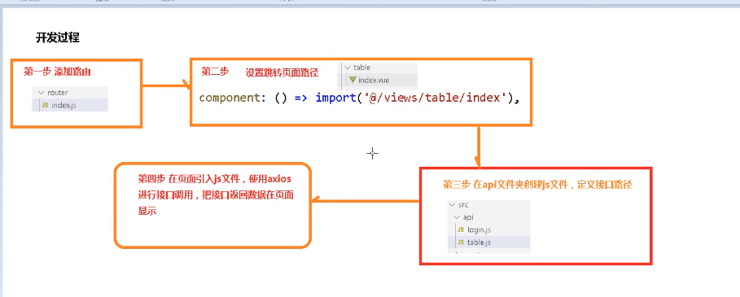

# 平台前端搭建




## 组件重用

**问题：**vue-router导航切换 时，如果两个路由都渲染同个组件，

组件的生命周期方法（created或者mounted）不会再被调用, 组件会被重用，显示上一个路由渲染出来的自建

**解决方案：**可以简单的在 router-view上加上一个唯一的key，来保证路由切换时都会重新触发生命周期方法，确保组件被重新初始化。

修改 src/views/layout/components/AppMain.vue 文件如下：

```
<router-view:key="key"></router-view>


computed: {key() {returnthis.$route.name !== undefined? this.$route.name + +newDate(): this.$route + +newDate()  } }
```