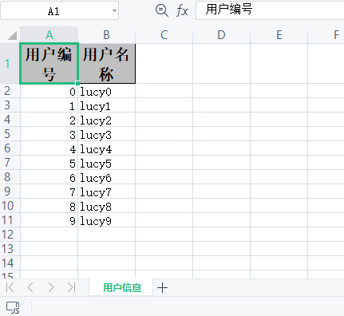

# easyexcel

Java解析、生成Excel比较有名的框架有Apache poi、jxl。但他们都存在一个严重的问题就是非常的耗内存，poi有一套SAX模式的API可以一定程度的解决一些内存溢出的问题，但POI还是有一些缺陷，比如07版Excel解压缩以及解压后存储都是在内存中完成的，内存消耗依然很大。easyexcel重写了poi对07版Excel的解析，能够原本一个3M的excel用POI sax依然需要100M左右内存降低到几M，并且再大的excel不会出现内存溢出，03版依赖POI的sax模式。在上层做了模型转换的封装，让使用者更加简单方便。

EasyExcel是一个基于Java的简单、省内存的读写Excel的开源项目。在尽可能节约内存的情况下支持读写百M的Excel。

文档地址：https://alibaba-easyexcel.github.io/index.html

github地址：https://github.com/alibaba/easyexcel


## 1 依赖

```xml
<dependencies>
    <!-- https://mvnrepository.com/artifact/com.alibaba/easyexcel -->
    <dependency>
        <groupId>com.alibaba</groupId>
        <artifactId>easyexcel</artifactId>
        <version>2.1.1</version>
    </dependency>
</dependencies>
```

## 2 实体类和注解

```java
/**
 * UserData <br>
 *
 * @author CQ <br>
 * @version 1.0 <br>
 * @date 2021-03-22 13:21 <br>
 */
@Data
public class UserData {
    @ExcelProperty("用户编号")
    private int uid;
    @ExcelProperty("用户名称")
    private String username;
}
```

## 3 写操作

```java
public class TestWrite {
    public static void main(String[] args) {
        //构建数据list集合
        List<UserData> list = new ArrayList<>();
        for (int i = 0; i < 10; i++) {
            UserData data = new UserData();
            data.setUid(i);
            data.setUsername("lucy"+i);
            list.add(data);
        }


        //设置excel文件路径和文件名称
        String fileName="E:\\excel\\01.xlsx";

        //调用方法实现写操作
        EasyExcel.write(fileName,UserData.class)
                .sheet("用户信息")
                .doWrite(list);
    }
}
```



## 4 读操作

实体类添加注解

```java
@Data
public class UserData {
    @ExcelProperty(value = "用户编号",index = 0)
    private int uid;
    @ExcelProperty(value = "用户名称",index = 1)
    private String username;
}

```

添加监听器继承AnalysisEventListener

```java
public class ExcelListener extends AnalysisEventListener<UserData> {
    //一行一行读取excel内容，从第二行读取
    @Override
    public void invoke(UserData userData, AnalysisContext analysisContext) {
        System.out.println(userData);
    }

    @Override
    public void invokeHeadMap(Map<Integer, String> headMap, AnalysisContext context) {
        System.out.println("表头信息" + headMap);
    }

    //读取之后执行
    @Override
    public void doAfterAllAnalysed(AnalysisContext analysisContext) {

    }
}
```

调用

```java
public class TestRead {
    public static void main(String[] args) {
        //读取文件路径
        String fileName="E:\\excel\\01.xlsx";

        //调用方法
        EasyExcel.read(fileName,UserData.class,new ExcelListener()).sheet().doRead();
    }
}
```

